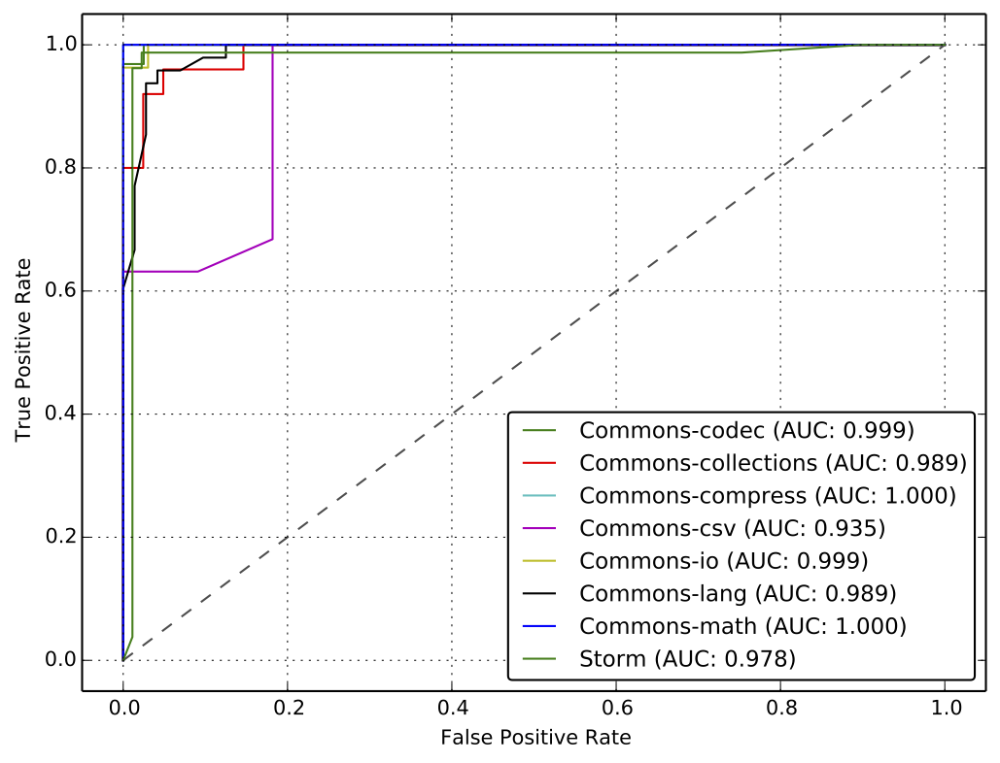

# influential-changes

One single code change can have a significant influence on a wide range of a software system and its users. For example, 1) adding a new feature can spread defects to the whole program, 2) updating a configuration may fix a problem hidden in all branches, and 3) changing an API method can improve the performance of all client programs. Developers often may not clearly know whether her/his or others’ changes are influential at the commit time. Rather, it turns out to be influential after affecting many aspects of a system later. Since some influential changes have negative effects, it is important to predict whether it is influential immediately after a change is submitted. Even for influential changes with positive effects, it is necessary to identify because other developers can benefit from the changes earlier.

This paper proposes an approach to influential change identification. We first conduct a post-mortem analysis to discover existing influential changes by using intuitions such as isolated changes and changes referred by other changes. Based on the influential changes discovered in the post-mortem analysis, we extract features of the changes. These features include several metrics such as the complexity of the changes, terms in commit logs, and their centrality in co-change graphs. Using the feature vectors of the changes, we build a prediction model based on machine learning algorithms. To evaluate the model, we conduct experiments on 10 open source projects. The experiment results show that our prediction model achieves overall 96.1% precision, 94.9% recall, and 95.2% F-measure, respectively. We further demonstrate the capability of our classifiers to perform in the wild for identifying influential changes previously unknown in the results of our observational study.

# Results

In the first round of experiments, we built a feature vectors with all features considered in our study. We then built classifiers using the Naive Bayes and the random forest algorithms. Comparing the F-measure performance in ten-fold cross-validation for the two algorithms, random forest performs on average better than Naive Bayes, although this difference is relatively small.

F-Measure | Algorithm | Commons-codec | Commons-collections | Commons-compress | Commons-csv | Commons-io | Commons-lang | Commons-math | Storm | Average
------------------------- | --------- | ------------- | ------------------- | ---------------- | ----------- | ---------- | ------------ |  ----------- | ----- | -------
Influential Class | NB | 95.1 | 92.9 | 91.5 | 84.2 | 98.5 | 89.2 | 94.3 | 86.1 | 91.5
Influential Class | RF | 97.4 | 96.4 | 98.2 | 77.8 | 97.0 | 95.0 | 99.1 | 97.8 | 94.8
Non Influential Class | NB | 93.5 | 87.5 | 83.9 | 92.7 | 98.1 | 79.5 | 92.6 | 86.5 | 89.3
Non Influential Class | RF | 97.0 | 93.9 | 97.1 | 90.5 | 96.3 | 92.9 | 98.9 | 97.5 | 95.5

The ROC plot above illustrates the performance of our binary classifier for the Influential class, for the different projects using Random Forest classification algorithm with the combination of all features. The Area Under Curve (AUC) metric values are all higher than 0.9 for all projects, implying a very performant prediction model.

# Dataset

* features: feature vectors extracted by categories
 * CC: Closeness centrality
 * NL: Natual language bag-of-words on commit messages
 * SI: Structural impact of files
* observation: Post-mortem analysis results
* prediction: Results from classifiers for predicting influential changes in the wild
