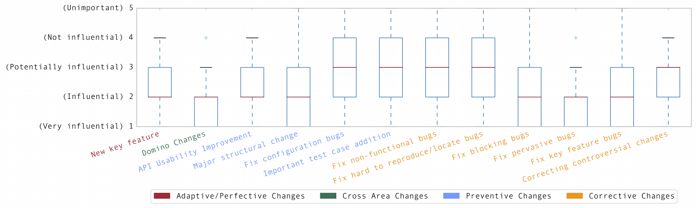

# influential-changes

One single code change can significantly influence a wide range of software
systems and their users. For example, 1) adding a new feature can spread defects
in several modules, while 2) changing an API method can improve the performance
of all client programs. Developers often may not clearly know whether their or
others’ changes are influential at commit time. Rather, it turns out to be
influential after affecting many aspects of a system later.

This paper investigates influential software changes and proposes an approach to
identify them early, i.e., immediately when they are applied. We first conduct a
post- mortem analysis to discover existing influential changes by using
intuitions such as isolated changes and changes referred by other changes in 10
open source projects. Then we re-categorize all identified changes through an
open-card sorting process. Subsequently, we conduct a survey with 89 developers
to confirm our influential change categories. Finally, from our ground truth we
extract features, including metrics such as the complexity of changes, terms in
commit logs and file centrality in co-change graphs, to build ma- chine learning
classifiers. The experiment results show that our prediction model achieves
overall with random samples 86.8% precision, 74% recall and 80.4% F-measure
respectively.

# Results

We conducted a survey asking developers how they think of influential software changes, and the following box plot shows the survey results.

In the first round of experiments, we built a feature vectors with all
features considered in our study. We then built classifiers using the Naive
Bayes and the random forest algorithms. Comparing the F-measure performance
in ten-fold cross-validation for the two algorithms, random forest performs
on average better than Naive Bayes, although this difference is relatively
small.

F-Measure | Algorithm | Commons-codec | Commons-collections | Commons-compress | Commons-csv | Commons-io | Commons-lang | Commons-math | Storm | Average
------------------------- | --------- | ------------- | ------------------- | ---------------- | ----------- | ---------- | ------------ |  ----------- | ----- | -------
Influential Class | NB | 95.1 | 92.9 | 91.5 | 84.2 | 98.5 | 89.2 | 94.3 | 86.1 | 91.5
Influential Class | RF | 97.4 | 96.4 | 98.2 | 77.8 | 97.0 | 95.0 | 99.1 | 97.8 | 94.8
Non Influential Class | NB | 93.5 | 87.5 | 83.9 | 92.7 | 98.1 | 79.5 | 92.6 | 86.5 | 89.3
Non Influential Class | RF | 97.0 | 93.9 | 97.1 | 90.5 | 96.3 | 92.9 | 98.9 | 97.5 | 95.5

The ROC plot above illustrates the performance of our binary classifier for
the Influential class, for the different projects using Random Forest
classification algorithm with the combination of all features. The Area
Under Curve (AUC) metric values are all higher than 0.9 for all projects,
implying a very performant prediction model.

# Dataset

* features: feature vectors extracted by categories
 * CC: Closeness centrality
 * NL: Natual language bag-of-words on commit messages
 * SI: Structural impact of files
* observation: Post-mortem analysis results
* random_samples: Randomly sampled and manually labelled 381 commits and their feature vectors
* survey: survey results
